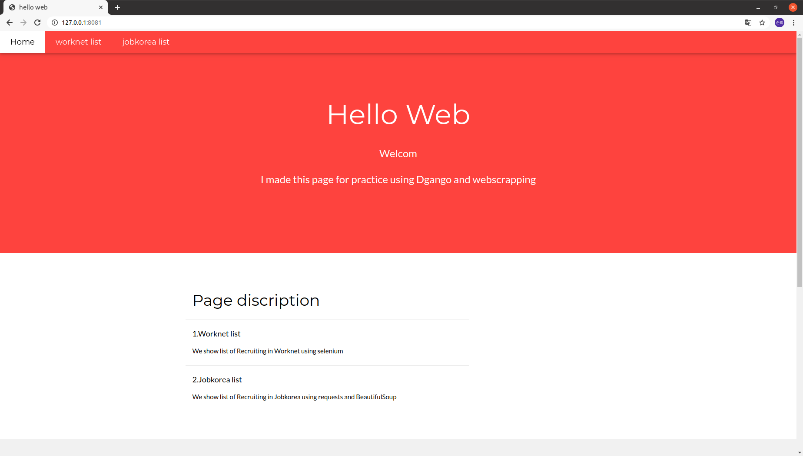
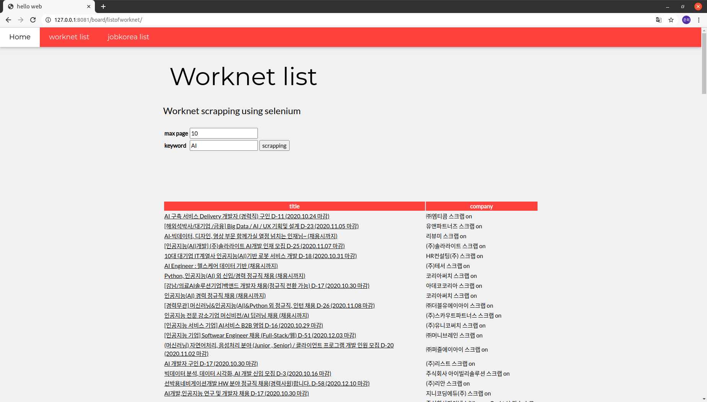
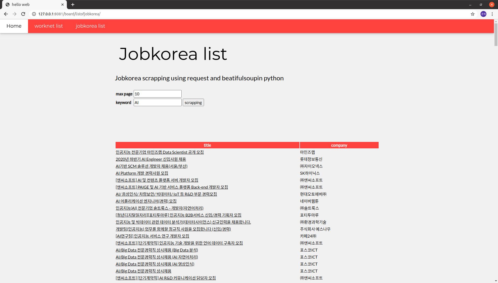

# Hello Django - Junhee
web scrapping, DB 저장, Web framework 학습 목적 프로젝트

## 적용 기술과 사용법
* Web Server
    * Django
    * CSS
    * HTML
* Database
    * MongoDB
* Web scrapping
    * BeautifulSoup
    * selenium

## 간략 화면 설명
* main page

* list of worknet

* list of jobkorea

